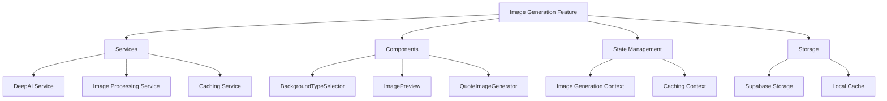

# AI Image Generation Implementation Plan

## Overview
This plan outlines the implementation of AI-powered background image generation for book quotes using the DeepAI API. The feature will be integrated into the existing book search and quote management system.

## System Architecture



## Implementation Phases

### Phase 1: Core Infrastructure 🔄

#### DeepAI Service Integration
- [ ] Set up API client with proper error handling
- [ ] Implement rate limiting mechanism
- [ ] Create TypeScript interfaces for API responses
- [ ] Add environment configuration for API keys

#### Storage Setup
- [ ] Create Supabase table for generated images
- [ ] Set up image metadata storage system
- [ ] Implement caching strategy
- [ ] Add image compression and optimization

#### Type Definitions
```typescript
interface ImageGenerationOptions {
  backgroundType: 'nature' | 'abstract' | 'cityscape' | 'vintage' | 'fantasy' | 'minimalist';
  prompt?: string;
  resolution?: string;
}

interface GeneratedImage {
  url: string;
  metadata: {
    backgroundType: string;
    timestamp: string;
    quoteId: string;
  };
}
```

### Phase 2: UI Components ⏳

#### Background Type Selector
- [ ] Create dropdown component for theme selection
- [ ] Add preview thumbnails for each theme
- [ ] Implement responsive design
- [ ] Add keyboard navigation support

#### Quote Image Generator
- [ ] Build image generation interface
- [ ] Add loading states and indicators
- [ ] Implement error handling UI
- [ ] Create retry mechanism
- [ ] Add progress tracking

#### Component Interfaces
```typescript
interface BackgroundTypeSelectorProps {
  value: string;
  onChange: (type: string) => void;
  disabled?: boolean;
}

interface QuoteImageGeneratorProps {
  quote: Quote;
  onImageGenerated: (image: GeneratedImage) => void;
  onError: (error: Error) => void;
}
```

### Phase 3: Integration ⏳

#### Quote Browser Integration
- [ ] Add image generation to quote display
- [ ] Implement social sharing features
- [ ] Add download functionality
- [ ] Integrate with existing quote management

#### Performance Optimizations
- [ ] Implement image caching system
- [ ] Add lazy loading for images
- [ ] Optimize image loading sequence
- [ ] Add progressive image loading

### Phase 4: Database Schema Updates ⏳

```sql
-- New table for generated images
create table generated_images (
  id uuid default uuid_generate_v4() primary key,
  quote_id uuid references quotes(id),
  image_url text not null,
  background_type text not null,
  created_at timestamp with time zone default timezone('utc'::text, now()),
  metadata jsonb
);

-- Index for faster lookups
create index idx_generated_images_quote_id on generated_images(quote_id);
```

## Technical Considerations

### Performance
- Implement aggressive caching for generated images
- Use WebP format for optimal compression
- Implement progressive loading for large images
- Cache API responses in localStorage

### Security
- Validate API key configuration
- Implement rate limiting
- Sanitize user inputs
- Validate image URLs

### Accessibility
- Provide alt text for generated images
- Ensure keyboard navigation
- Add ARIA labels for controls
- Support screen readers

### Error Handling
- Implement graceful fallbacks for API failures
- Add retry mechanism for failed generations
- Display clear error messages
- Show appropriate loading states

## Next Steps
1. Begin Phase 1 implementation with DeepAI service setup
2. Create basic UI components for testing
3. Set up Supabase storage integration
4. Implement core image generation functionality
5. Add UI components and integration
6. Perform testing and optimization

Legend:
- ✅ Completed
- 🔄 In Progress
- ⏳ Pending