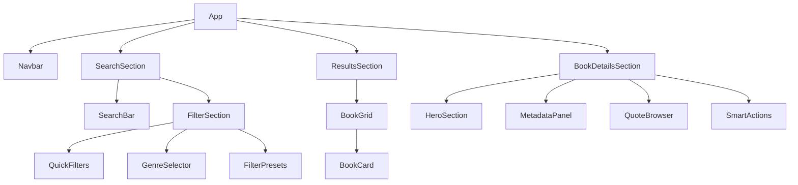
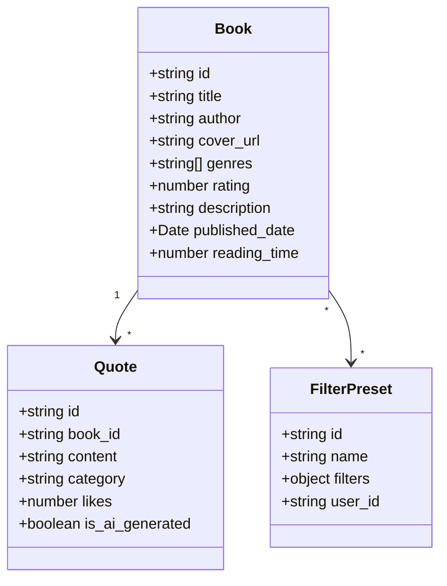

# Book Search & Selection System Implementation Plan

## 1. Component Structure

### Component Hierarchy

## 2. Data Structure

### Data Models

## 3. Implementation Phases

### Phase 1: Search Interface
1. Create responsive search bar component with real-time suggestions
2. Implement filter components:
   - Quick filter buttons (Trending, Latest, By Genre)
   - Genre selector with icons
   - Filter preset system
3. Add search state management using React context

### Phase 2: Results Display
1. Create responsive book card grid
2. Implement book card component with:
   - Cover image
   - Title and author
   - Rating display
   - Quick action buttons
3. Add hover animations and interaction states
4. Implement pagination or infinite scroll

### Phase 3: Book Details View
1. Create book details modal/page with:
   - Hero section for cover art
   - Metadata panel
   - Community rating system
2. Implement quote browser:
   - Quote list with categories
   - AI quote generation integration
   - Quote sharing functionality
3. Add smart actions panel

### Phase 4: Backend Integration
1. Set up Supabase tables for:
   - Books
   - Quotes
   - User preferences
   - Filter presets
2. Create API services for:
   - Book search and filtering
   - Quote management
   - User interactions
3. Implement caching for offline quote access

## 4. Technical Considerations

### State Management
- Use React Context for global state (theme, filters)
- Consider implementing Redux if state complexity grows
- Use React Query for API data caching

### Performance
- Implement virtual scrolling for large result sets
- Use image lazy loading for book covers
- Cache search results and quotes
- Implement debouncing for search input

### Accessibility
- Ensure ARIA labels are present
- Implement keyboard navigation
- Maintain proper contrast ratios
- Add screen reader support

### Mobile Responsiveness
- Use Tailwind's responsive classes
- Implement touch-friendly interactions
- Optimize layout for different screen sizes
- Consider gesture controls for mobile