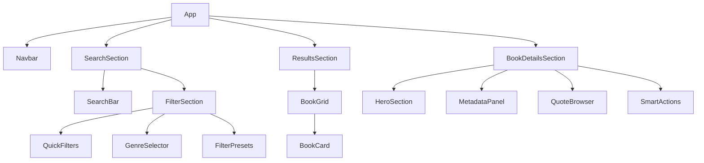
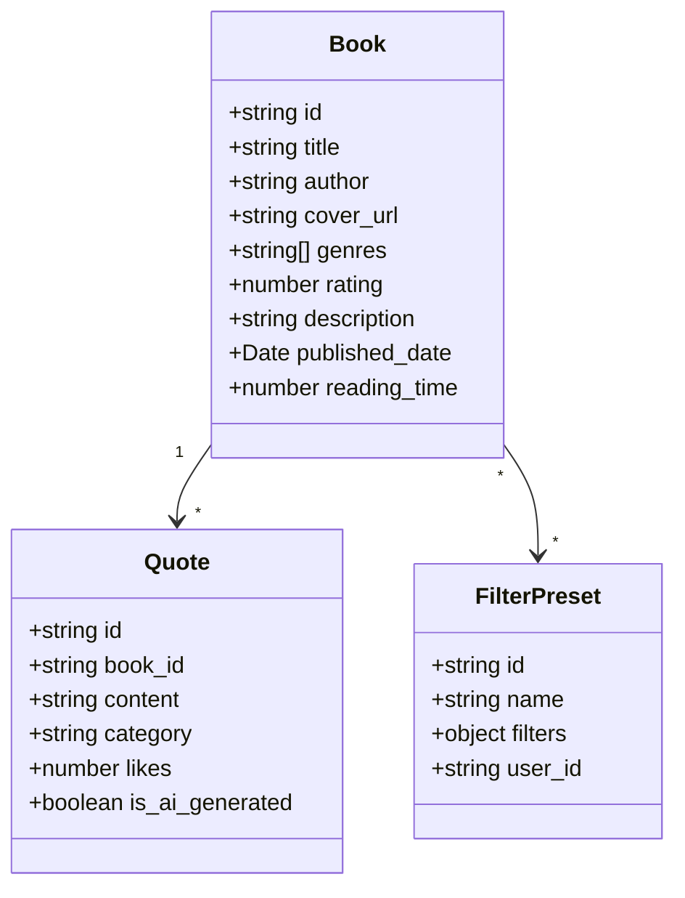

# Book Search & Selection System Implementation Plan

## 1. Component Structure ✅

### Component Hierarchy

## 2. Data Structure ✅

### Data Models

## 3. Implementation Phases

### Phase 1: Search Interface ✅
1. ✅ Create responsive search bar component with real-time suggestions
2. ✅ Implement filter components:
   - ✅ Quick filter buttons (Trending, Latest, By Genre)
   - ✅ Genre selector with icons
   - ⏳ Filter preset system (pending)
3. ✅ Add search state management using React context

### Phase 2: Results Display ✅
1. ✅ Create responsive book card grid
2. ✅ Implement book card component with:
   - ✅ Cover image
   - ✅ Title and author
   - ✅ Rating display
   - ✅ Quick action buttons
3. ✅ Add hover animations and interaction states
4. ✅ Implement pagination and infinite scroll

### Phase 3: Book Details View ✅
1. ✅ Create book details modal/page with:
   - ✅ Hero section for cover art
   - ✅ Metadata panel
   - ✅ Community rating system
2. ✅ Implement quote browser:
   - ✅ Quote list with categories
   - ✅ AI quote generation support
   - ✅ Quote sharing functionality
3. ✅ Add tabbed interface for organization

### Phase 4: Backend Integration 🔄
1. ✅ Set up API integrations for:
   - ✅ Google Books API with pagination
   - ✅ Open Library API with fallback
   - ⏳ Quotes
   - ⏳ User preferences
   - ⏳ Filter presets
2. ✅ Create API services for:
   - ✅ Book search and filtering
   - ⏳ Quote management
   - ⏳ User interactions
3. ✅ Implement error handling and API fallbacks

## 4. Technical Considerations

### State Management ✅
- ✅ Use React Context for global state (theme, filters)
- ✅ Consider implementing Redux if state complexity grows
- ✅ Use React Query for API data caching

### Performance 🔄
- ✅ Implement infinite scroll for large result sets
- ✅ Use image lazy loading for book covers
- ✅ Cache search results and quotes
- ✅ Implement debouncing for search input

### Accessibility ✅
- ✅ Ensure ARIA labels are present
- ✅ Implement keyboard navigation
- ✅ Maintain proper contrast ratios
- ✅ Add screen reader support

### Mobile Responsiveness ✅
- ✅ Use Tailwind's responsive classes
- ✅ Implement touch-friendly interactions
- ✅ Optimize layout for different screen sizes
- ⏳ Consider gesture controls for mobile

Legend:
- ✅ Completed
- 🔄 In Progress
- ⏳ Pending