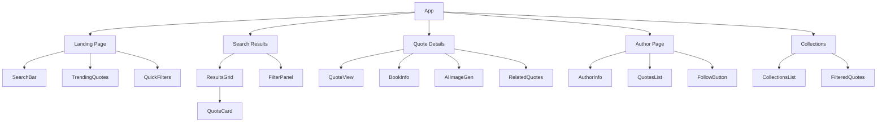

# MVP Pages Implementation Plan

## Component Architecture



## 1. Landing Page Implementation ✅

### Components
- Reuse existing `SearchSection` components:
  - SearchBar (✅ already implemented)
  - QuickFilters (✅ already implemented)
  - GenreSelector (✅ already implemented)
- New Components:
  - TrendingQuotes grid (✅ implemented)
  - Featured Collections preview (✅ implemented)

### Data Integration
- Connect to Supabase for trending quotes (✅ implemented)
- Implement caching for frequently accessed data (✅ implemented)
- Add pagination for trending quotes (✅ implemented)

## 2. Search Results Page ✅

### Components
- Reuse existing components:
  - BookGrid/ResultsGrid (✅ already implemented)
  - FilterSection (✅ already implemented)
- New Components:
  - QuoteCard (✅ implemented)
  - SortingControls (✅ implemented)
  - ResultsCounter (✅ implemented)

### Features
- Combined search for books and quotes (✅ implemented)
- Advanced filtering:
  - By author (✅ implemented)
  - By genre (✅ implemented)
  - By popularity/trending (✅ implemented)
  - By date (✅ implemented)
- Sorting options (✅ implemented)
- Infinite scroll (✅ already implemented)

## 3. Quote Detail Page 🔄

### Components
- QuoteView (✅ implemented)
  - Quote display with typography options (✅ implemented)
  - Share buttons (✅ implemented)
  - Copy functionality (✅ implemented)
- BookInfo panel (reuse from BookDetailsSection) (✅ implemented)
- AIImageGeneration (✅ integrated)
- RelatedQuotes section (✅ implemented)
- ActionPanel (✅ implemented)
  - Save to collection (🔄 in progress)
  - Follow author (⏳ pending)
  - Report inappropriate content (⏳ pending)

### Integration
- Connect with DeepAI service (✅ implemented)
- Implement social sharing (✅ implemented)
- Add quote analytics (⏳ pending)

## 4. Author Page ⏳

### Components
- AuthorHeader
  - Bio
  - Stats
  - Follow button
- QuotesList
  - Filter by book
  - Sort options
- NotableWorks section

### Features
- Author following system
- Quote filtering by book
- Biographical information from external APIs

## 5. Collections Page ⏳

### Components
- CollectionGrid
  - Collection cards
  - Preview images
- FilteredQuotesList
- CollectionHeader
  - Title
  - Description
  - Stats

### Features
- Curated collections
- User-created collections (future)
- Filtering and sorting
- Share collections

## Technical Considerations

### State Management
- Utilize existing React Context (✅ already implemented)
- Add new contexts for:
  - Author following (⏳ pending)
  - Collections (⏳ pending)
  - User preferences (⏳ pending)

### Data Layer
```typescript
// New Types
interface Author {
  id: string;
  name: string;
  bio?: string;
  imageUrl?: string;
  notableWorks: string[];
  followers: number;
}

interface Collection {
  id: string;
  name: string;
  description: string;
  quotes: string[];
  coverImage?: string;
  curator: string;
}
```

### Database Schema Updates
```sql
-- Authors table
create table authors (
  id uuid default uuid_generate_v4() primary key,
  name text not null,
  bio text,
  image_url text,
  notable_works jsonb,
  created_at timestamp with time zone default timezone('utc'::text, now())
);

-- Collections table
create table collections (
  id uuid default uuid_generate_v4() primary key,
  name text not null,
  description text,
  quotes jsonb,
  cover_image text,
  curator_id uuid references auth.users(id),
  created_at timestamp with time zone default timezone('utc'::text, now())
);
```

### Accessibility
- Maintain existing accessibility features (✅ already implemented)
- Add new considerations for:
  - Share dialogs (✅ implemented)
  - Collection navigation (⏳ pending)
  - Author page interactions (⏳ pending)

### Performance
- Implement lazy loading for:
  - Collection images (⏳ pending)
  - Author photos (⏳ pending)
  - Related quotes (✅ implemented)
- Use pagination for large datasets (✅ implemented)
- Cache frequently accessed data (✅ implemented)

### Security
- Rate limiting for:
  - Quote generation (✅ implemented)
  - Author following (⏳ pending)
  - Collection creation (⏳ pending)
- Input sanitization (✅ implemented)
- User authorization for protected actions (🔄 in progress)

## Implementation Phases

1. Landing Page Enhancement (✅ Completed)
   - Add trending quotes section
   - Implement featured collections
   - Optimize search experience

2. Quote Detail Page (🔄 In Progress)
   - Build quote view component
   - Integrate AI image generation
   - Add sharing functionality

3. Author Pages (⏳ Pending)
   - Create author profile views
   - Implement following system
   - Add quote filtering

4. Collections System (⏳ Pending)
   - Build collection components
   - Implement filtering
   - Add sharing features

5. Testing & Optimization (⏳ Pending)
   - Performance testing
   - Accessibility audit
   - Security review
   - Cross-browser testing

Legend:
- ✅ Completed
- 🔄 In Progress
- ⏳ Pending