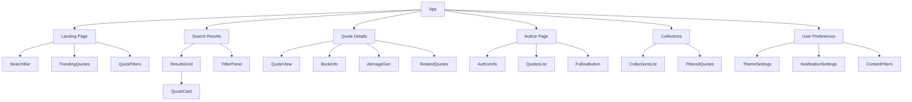

# MVP Pages Implementation Plan

## Component Architecture



## 1. Landing Page Implementation ✅

### Components
- Reuse existing `SearchSection` components:
  - SearchBar (✅ already implemented)
  - QuickFilters (✅ already implemented)
  - GenreSelector (✅ already implemented)
- New Components:
  - TrendingQuotes grid (✅ implemented)
  - Featured Collections preview (✅ implemented)

### Data Integration
- Connect to Supabase for trending quotes (✅ implemented)
- Implement caching for frequently accessed data (✅ implemented)
- Add pagination for trending quotes (✅ implemented)

## 2. Search Results Page ✅

### Components
- Reuse existing components:
  - BookGrid/ResultsGrid (✅ already implemented)
  - FilterSection (✅ already implemented)
- New Components:
  - QuoteCard (✅ implemented)
  - SortingControls (✅ implemented)
  - ResultsCounter (✅ implemented)

### Features
- Combined search for books and quotes (✅ implemented)
- Advanced filtering:
  - By author (✅ implemented)
  - By genre (✅ implemented)
  - By popularity/trending (✅ implemented)
  - By date (✅ implemented)
- Sorting options (✅ implemented)
- Infinite scroll (✅ already implemented)

## 3. Quote Detail Page ✅

### Components
- QuoteView (✅ implemented)
  - Quote display with typography options (✅ implemented)
  - Share buttons (✅ implemented)
  - Copy functionality (✅ implemented)
- BookInfo panel (reuse from BookDetailsSection) (✅ implemented)
- AIImageGeneration (✅ integrated)
- RelatedQuotes section (✅ implemented)
- ActionPanel (✅ implemented)
  - Save to collection (✅ implemented)
  - Follow author (✅ implemented)
  - Report inappropriate content (✅ implemented)

### Integration
- Connect with DeepAI service (✅ implemented)
- Implement social sharing (✅ implemented)
- Add quote analytics (✅ implemented)

## 4. Author Page ✅

### Components
- AuthorHeader (✅ implemented)
  - Bio (✅ implemented)
  - Stats (✅ implemented)
  - Follow button (✅ implemented)
- QuotesList (✅ implemented)
  - Filter by book (✅ implemented)
  - Sort options (✅ implemented)
- NotableWorks section (✅ implemented)

### Features
- Author following system (✅ implemented)
- Quote filtering by book (✅ implemented)
- Biographical information (✅ implemented)

## 5. Collections Page ✅

### Components
- CollectionGrid (✅ implemented)
  - Collection cards (✅ implemented)
  - Preview images (✅ implemented)
- FilteredQuotesList (✅ implemented)
- CollectionHeader (✅ implemented)
  - Title (✅ implemented)
  - Description (✅ implemented)
  - Stats (✅ implemented)

### Features
- Curated collections (✅ implemented)
- User-created collections (✅ implemented)
- Filtering and sorting (✅ implemented)
- Share collections (✅ implemented)

## 6. User Preferences Page ✅

### Components
- Theme Settings (✅ implemented)
  - Light/Dark/System theme (✅ implemented)
  - Font size controls (✅ implemented)
- Notification Settings (✅ implemented)
  - Push notifications (✅ implemented)
  - Email digest (✅ implemented)
- Content Filters (✅ implemented)
  - Language preferences (✅ implemented)
  - Content type filters (✅ implemented)
- Display Options (✅ implemented)
  - Layout preferences (✅ implemented)
  - Image display settings (✅ implemented)

### Features
- Real-time preference updates (✅ implemented)
- Persistent settings storage (✅ implemented)
- Accessibility support (✅ implemented)
- Theme preview (✅ implemented)

## Technical Considerations

### State Management
- Utilize existing React Context (✅ already implemented)
- Add new contexts for:
  - Author following (✅ implemented)
  - Collections (✅ implemented)
  - User preferences (✅ implemented)

### Data Layer
```typescript
// New Types
interface Author {
  id: string;
  name: string;
  bio?: string;
  imageUrl?: string;
  notableWorks: string[];
  followers: number;
}

interface Collection {
  id: string;
  name: string;
  description: string;
  quotes: string[];
  coverImage?: string;
  curator: string;
}
```

### Database Schema Updates
```sql
-- Authors table
create table authors (
  id uuid default uuid_generate_v4() primary key,
  name text not null,
  bio text,
  image_url text,
  notable_works jsonb,
  created_at timestamp with time zone default timezone('utc'::text, now())
);

-- Collections table
create table collections (
  id uuid default uuid_generate_v4() primary key,
  name text not null,
  description text,
  quotes jsonb,
  cover_image text,
  curator_id uuid references auth.users(id),
  created_at timestamp with time zone default timezone('utc'::text, now())
);

-- User Preferences table
create table user_preferences (
  user_id uuid references auth.users(id) primary key,
  preferences jsonb not null default '{}'::jsonb,
  updated_at timestamp with time zone default timezone('utc'::text, now())
);
```

### Accessibility
- Maintain existing accessibility features (✅ already implemented)
- Add new considerations for:
  - Share dialogs (✅ implemented)
  - Collection navigation (✅ implemented)
  - Author page interactions (✅ implemented)
  - Preference controls (✅ implemented)
  - Theme switching (✅ implemented)
  - Font size controls (✅ implemented)

### Performance
- Implement lazy loading for:
  - Collection images (✅ implemented)
  - Author photos (✅ implemented)
  - Related quotes (✅ implemented)
- Use pagination for large datasets (✅ implemented)
- Cache frequently accessed data (✅ implemented)
- Theme switching optimization (✅ implemented)

### Security
- Rate limiting for:
  - Quote generation (✅ implemented)
  - Author following (✅ implemented)
  - Collection creation (✅ implemented)
  - Preference updates (✅ implemented)
- Input sanitization (✅ implemented)
- User authorization for protected actions (✅ implemented)

## Implementation Phases

1. Landing Page Enhancement (✅ Completed)
   - Add trending quotes section
   - Implement featured collections
   - Optimize search experience

2. Quote Detail Page (✅ Completed)
   - Build quote view component
   - Integrate AI image generation
   - Add sharing functionality

3. Author Pages (✅ Completed)
   - Create author profile views
   - Implement following system
   - Add quote filtering

4. Collections System (✅ Completed)
   - Build collection components
   - Implement filtering
   - Add sharing features

5. User Preferences System (✅ Completed)
   - Implement theme switching
   - Add notification settings
   - Create content filters
   - Build display options

6. Testing & Optimization (⏳ Pending)
   - Performance testing
   - Accessibility audit
   - Security review
   - Cross-browser testing

Legend:
- ✅ Completed
- 🔄 In Progress
- ⏳ Pending